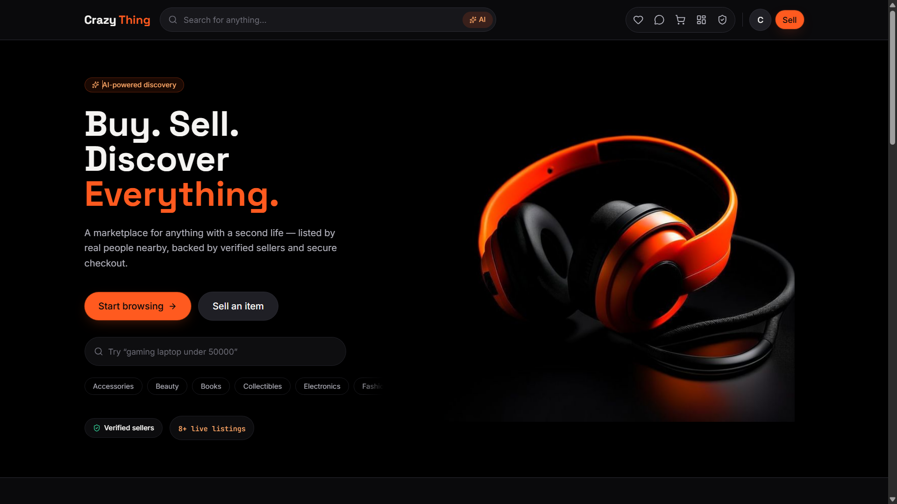
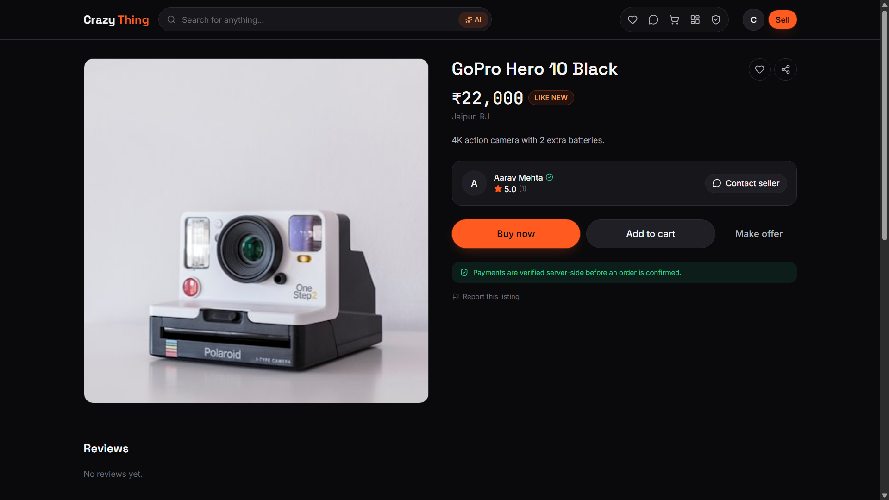
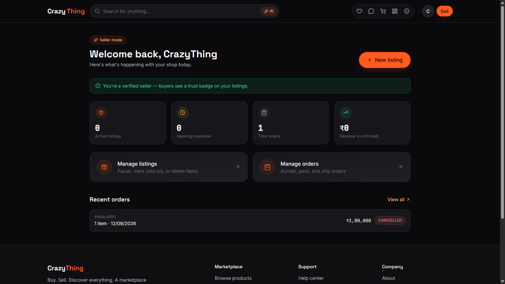
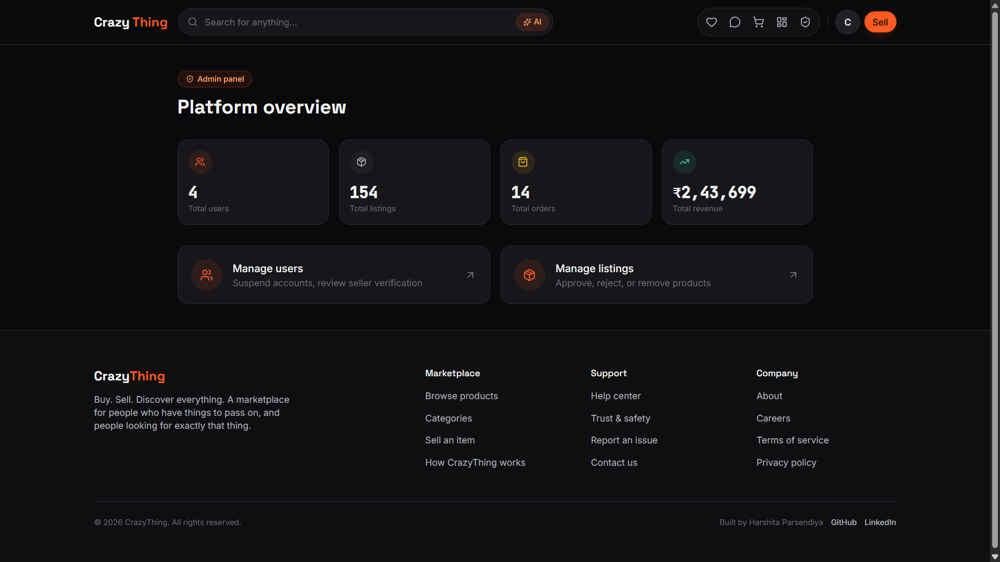

<div align="center">

# CrazyThing

### Buy. Sell. Discover Everything.

**A full-stack C2C marketplace platform — built to demonstrate end-to-end MERN development, secure payment integration, and production-style backend architecture.**

[](LICENSE)
[](https://nodejs.org)
[](client)
[](server)

🔗 **Live demo:** [crazy-thing.vercel.app](https://crazy-thing.vercel.app)
🔗 **API health:** [crazything-api.onrender.com/api/health](https://crazything-api.onrender.com/api/health)

</div>

---

## Screenshots

| Homepage | Product Details |
|---|---|
|  |  |

| Seller Dashboard | Admin Panel |
|---|---|
|  |  |

---

## Why this project

Most portfolio marketplace clones stop at CRUD. CrazyThing goes further on the parts that actually matter in production:

- **Server-authoritative pricing** — the cart and checkout never trust a price sent from the client; every total is recalculated from the database at request time.
- **Real payment verification** — Razorpay's client-side "success" callback is never trusted alone; the backend independently verifies the HMAC-SHA256 signature before an order is marked paid.
- **Graceful degradation** — both the AI listing assistant and the payment flow detect missing API credentials and fall back to a clearly-labeled mock mode, so the whole app is testable without paid API access.
- **Tested, not just built** — Jest + Supertest integration tests cover authentication, listing ownership, and pricing integrity against an in-memory MongoDB.

---

## Features

| Role | Capabilities |
|---|---|
| **Buyer** | Search & filter listings, wishlist, server-verified cart, Razorpay checkout, order tracking timeline, product/seller reviews |
| **Seller** | AI listing assistant (title/description/price from a rough description), seller dashboard with stats, order fulfillment (accept → pack → ship with tracking), verification requests |
| **Admin** | Platform analytics, user suspension, seller verification approval, listing moderation |
| **Platform** | JWT auth + bcrypt, rate-limited endpoints, role-based access control, 13-state order lifecycle, audit history |

---

## Tech stack

| Layer | Stack |
|---|---|
| Frontend | React, Vite, Redux Toolkit, React Router, Tailwind CSS, React Hook Form |
| Backend | Node.js, Express, MongoDB, Mongoose, JWT, bcrypt |
| Payments | Razorpay (test mode; mock fallback when no keys are configured) |
| AI | Anthropic API for listing suggestions, with a rule-based offline fallback |
| Testing | Jest, Supertest, mongodb-memory-server |
| Deployment | Vercel (frontend) · Render (backend) · MongoDB Atlas (database) |

---

## Architecture

Data flow: `routes → controllers → models`, with third-party integrations (payments, AI, email) isolated behind a `services/` layer so they can be swapped or mocked independently of business logic.

---

## Running locally

### Prerequisites
- Node.js 18+
- A MongoDB connection string ([Atlas free tier](https://www.mongodb.com/cloud/atlas) works)

### Backend

```bash
cd server
npm install
cp .env.example .env      # fill in MONGO_URI and JWT_SECRET at minimum
npm run seed                # optional — creates demo admin/seller accounts and products
npm run dev
```

Runs on `http://localhost:5000`. Health check: `GET /api/health`.

### Frontend

```bash
cd client
npm install
cp .env.example .env
npm run dev
```

Runs on `http://localhost:5173`.

### Tests

```bash
cd server
npm test
```

14 integration tests covering signup/login, listing ownership, and server-side price/stock validation.

---

## Environment variables

See `server/.env.example` and `client/.env.example` for the full list. The backend runs with just `MONGO_URI` and `JWT_SECRET` set — Razorpay and the AI assistant fall back to a demo mode without credentials.

---

## Design notes

- **Pricing integrity**: `Order.items` snapshot the product price at purchase time, so a later price change on the listing never retroactively alters a past order.
- **Payment flow**: `POST /api/orders` creates a Razorpay order server-side → client opens the Razorpay checkout modal → `POST /api/payments/verify` independently checks the returned signature before touching order/payment status.
- **AI fallback**: `services/aiService.js` calls the Anthropic API when `AI_API_KEY` is set; otherwise a deterministic rule-based generator produces a title/description/price range, clearly flagged as `isMock: true` in the response.

---

## Author

Built by **Harshita Parsendiya** — [GitHub](https://github.com/harshiiii18)

---

## License

MIT